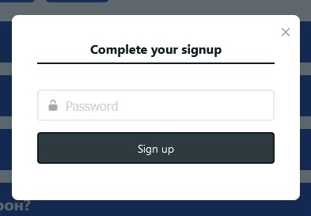
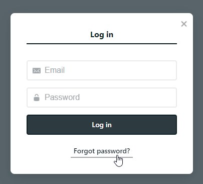
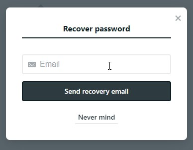
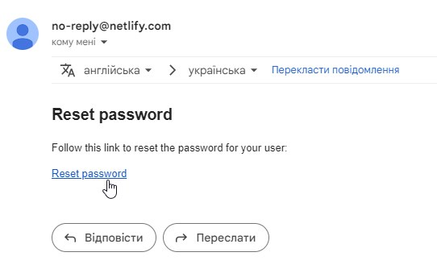
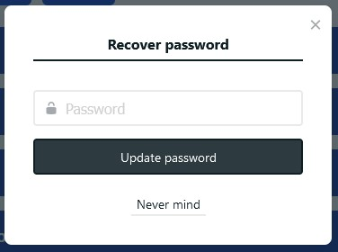
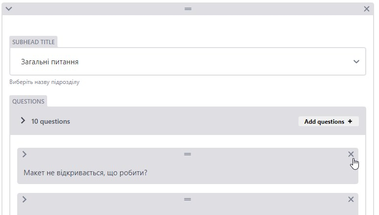

# 📋 ПРАВИЛА КОРИСТУВАННЯ АДМІН-ПАНЕЛЛЮ

- [Повернутися назад 🔙](README.md)

## ДОСТУП ДО АДМІН-ПАНЕЛІ

Панель адміністратора сайту відкривається при переході за посиланням:
https://gw-fe-marathon.netlify.app/admin.

Доступ до адмін-панелі можна отримати лише за запрошенням на електронну пошту.
Потрібно відкрити лист та перейти за посиланням із назвою **_"Accept the
invite"_**:

При кліку користувача переадресує на сайт, де йому потрібно перейти в
адмін-панель, додавши у адресному рядку браузера **_"/admin"_**.

Відкриється вікно із проханням завершити реєстрацію. Для цього у полі потрібно
ввести пароль, який користувач буде використовувати для входу в адмін-панель:

Після кліку на кнопку **_"Sign up"_** користувачу буде надано доступ до
адмін-панелі.

---

Якщо є необхідність змінити пароль або відновити його у випадку втрати,
користувач при вході може натиснути на відповідну кнопку - **_"Forgot
password?"_**:

Далі потрібно ввести пошту, на яку користувач отримував запрошення і натиснути
**_"Send recovery email"_**:

Адміністратор отримає лист на введену пошту із проханням підтвердити зміну
пароля. Для цього потрібно перейти за посиланням у листі - **_"Reset
password"_**:

Далі потрібно лише ввести новий пароль у вікні, що відкриється та зберегти
зміни:

## СТРУКТУРА АДМІН-ПАНЕЛІ

Адмін-панель має структуру, показану на рисунку:

- **List of Chapters** - це перелік розділів (у нашому випадку - днів).

  

  Він представлений як один елемент колекції під назвою **_"Перелік днів"_**,
  який не можна видалити. Також не можна створити новий елемент. Передбачена
  лише можливість редагування розділів всередині даного переліку.

  При переході на нього адміністратор побачить список уже створених розділів
  (днів). Назви елементів списку використовуються у якості назв папок для
  збереження розділів (**_CHAPTER NAME: start, day-1_** та ін.)

  

  ***

  ⚠️ **Цей перелік потрібно редагувати лише у конкретних випадках (див. нижче
  "Правила додавання нових записів").**

  ***

- **List of Subheads** - це перелік підрозділів (у нашому випадку - **_"Загальні
  питання"_** та **_"VSCode"_**).

  

  Він також представлений як один елемент колекції, який не можна видалити, так
  само як і не можна створити новий елемент. Передбачена лише можливість
  редагування підрозділів всередині даного переліку.

  При переході на перелік адміністратор побачить список уже створених
  підрозділів (**_"Загальні питання"_** та **_"VSCode"_**).

  ## 

  ***

  ⚠️ **Цю колекцію потрібно редагувати лише у конкретних випадках (див. нижче
  "Правила додавання нових записів").**

  ***

  Далі слідують колекції, упорядковані за мовою контенту:

- **Chapters_UA**
- **Chapters_RU**
- **Chapters_EN**

  Елементами цих колекцій є розділи із переліку **_List of Chapters_** (у нашому
  випадку - дні).

  

  ***

## ПРАВИЛА ДОДАВАННЯ НОВИХ ЗАПИСІВ

В основному адміністратор працюватиме з колекціями **_Chapters_UA_**,
**_Chapters_RU_** та **_Chapters_EN_**, додаючи нові запитання.

Однак проєктом також передбачена можливість динамічного додавання нових розділів
(днів) та підрозділів, які після створення через адмін-панель автоматично будуть
додаватися на сайті.

### Додавання розділів (у нашому випадку - днів)

Для створення нового розділу в адмін-панелі потрібно зайти у колекцію **_List of
Chapters -> Перелік розділів_**. Далі потрібно натиснути на кнопку **_"Add
chapter item"_** та ввести дані для нового розділу.

Значення, введене у поле **_CHAPTER NAME_**, обов'язково повинне містити лише
малі латинські літери, цифри та тире, наприклад, **_"day-7"_**.

Після додавання нового елемента списку потрібно натиснути кнопку **_Publish ->
Publish now_**. Нові дані автоматично відправляться у репозиторій проєкту, а
після успішного збереження адміністратор побачить повідомлення **_"Entry
saved"_**. Після цього потрібно повернутися до основної сторінки адмін-панелі.

Після того, як розділ додано, адміністратор може перейти в колекції
**_Chapters_UA_**, **_Chapters_RU_** та **_Chapters_EN_** та почергово додати
запитання для нового розділу відповідними мовами. Для цього потрібно натиснути
на темну кнопку **_New Chapters_** вгорі.

Далі потрібно заповнити поля, слідуючи вказівкам біля кожного поля. У полі
**_CHAPTER_** із випадаючого списку необхідно вибрати новостворений розділ,
наприклад, **_"day-7"_**.

У полі **_TITLE AT PAGE_** потрібно ввести назву для відображення даного розділу
на сайті (наприклад, **_"День 1"_** для колекції **_Chapters_UA_**, **_"Day
1"_** для колекції **_Chapters_EN_** тощо).

Потім потрібно натиснути на кнопку **_"Add subhead"_** та обрати у полі
**_SUBHEAD TITLE_** із випадаючого меню потрібний підрозділ (**_Основні
питання_** чи **_VSCode_**).

Після цього можна додавати запитання, натискаючи на кнопку **_"Add questions"_**
та заповнюючи необхідні поля **_QUESTION TITLE_** і **_DESCRIPTION_**:

У полі **_QUESTION TITLE_** є можливість додати теги або назви файлів тощо,
обгорнувши їх у **_code_**.

У полі **_DESCRIPTION_** за необхідності можна додати зображення, натиснувши на
**_+_**, а також **_code_**, посилання, чи виділити частину відповіді
напівжирним шрифтом.

---

⚠️ **При додаванні тегів, наприклад, 
 або  у текст запитання або
відповіді, обов'язково потрібно слідкувати за тим, що вони були обгорнуті із
використанням символу **_"<>"_** на панелі. В іншому випадку дані будуть
відображатися на сайті некоректно.**

---

Поле **_QUESTION RANGE_** не є обов'язковим, але воно позначає черговість
розміщення питання на сторінці і використовується для сортування запитань на
сайті.

Поле **_CHAPTER RANGE_** останнє в кожному розділі, і воно позначає черговість
розміщення розділу на сайті та використовується для сортування днів марафону.

Запитання та дні, для яких адміністратор залишить незаповненими **_QUESTION
RANGE_** або **_CHAPTER RANGE_**, автоматично потраплять на початок відповідних
списків на сайті. Наприклад, при створенні **_"День 7"_** без заданого
**_CHAPTER RANGE_**, на сайті цей день буде відображений першим, а після нього -
розділи **_"Старт"_** та ін.

### Додавання підрозділів

У випадку створення нового підрозділу запитань (наприклад, **_"Дизайн"_**)
потрібно зайти у колекцію **_List of Subheads -> Перелік підрозділів_**. Далі
треба натиснути на кнопку **_"Add subhead item"_** та ввести дані для нового
підрозділу.

Адміністратору необхідно заповнити усі поля. У полі **_SUBHEAD VALUE_** потрібно
ввести значення, яке обов'язково повинне містити лише малі латинські літери,
цифри та тире, наприклад, **_"design"_**.

**_SUBHEAD AT PAGE_** - це поля для введення назви підрозділу кожною мовою. Це
значення використовується для відображення підрозділу на сайті.

Поле **_SUBHEAD RANGE_** позначає черговість розміщення підрозділу у розділі.

Після публікації змін даний підрозділ стане доступним для вибору у випадаючому
меню поля **_SUBHEAD TITLE_** у кожній колекції **_Chapters_**.

---

⚠️ **Адміністратор має можливість змінити вже існуючі дані у переліках розділів
та підрозділів колекцій **_List of Chapters_** та **_List of Subheads_**.**

**Наприклад, при потребі змінити **_"day-3-5"_** на **_"day-3"_** є можливість
редагування уже існуючого розділу. Але для застосування змін потрібно
обов'язково повторно вибрати даний розділ чи підрозділ із випадаючого списку у
всіх колекціях, в яких він уже використовується.**

---

Також реалізована можливість видалення певних елементів, наприклад, питань чи
підрозділів. Для цього потрібно натиснути на хрестик у правому верхньому куті
елемента:

Для видалення цілого розділу (дня) адміністратору потрібно натиснути "Delete
entry" вгорі вибраного елемента колекції:

### Приємного користування!

- [Повернутися назад 🔙](README.md)
