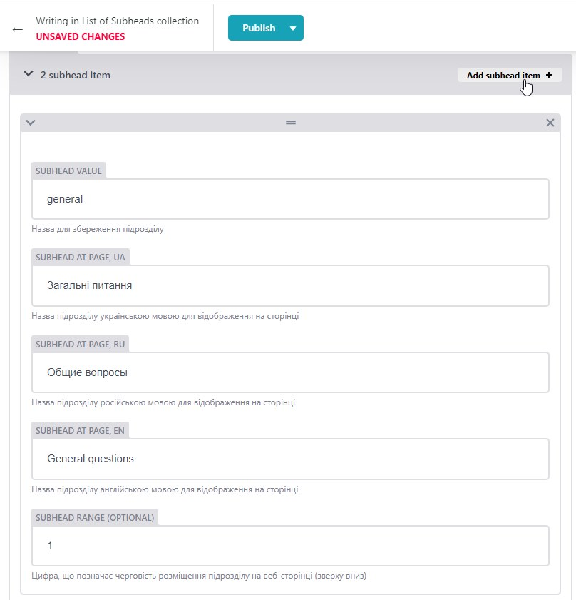

# 📋 Правила користування адмін-панеллю

## Доступ до адмін-панелі

Панель адміністратора сайту відкривається при переході за посиланням: /admin/.

Доступ можна отримати лише за запрошенням на електронну пошту. Потрібно відкрити
лист та перейти за посиланням у ньому. У вікні, що відкриється, користувач
побачить форму з можливістю авторизуватися. Для цього потрібно обрати Sign Up і
ввести у формі email та пароль. // ??

Після цього адміністратор отримає лист на введену пошту із проханням підтвердити
реєстрацію. Для цього потрібно перейти за посиланням у листі.

## Структура адмін-панелі

Адмін-пенель має наступну структуру:

- List of Chapters - це перелік розділів (у нашому випадку - днів).

  

  Він представлений як один елемент колекції, який не можна видалити. Також не
  можна створити новий елемент. Передбачена лише можливість редагування розділів
  всередині даної колекції.

  При переході на перелік днів адміністратор побачить його структуру, яка
  складається із списку. Елементами списку є назви папок для збереження розділів
  (CHAPTER NAME: start, day-1 та ін.)
  

  ⚠️ Цей перелік потрібно редагувати лише у конкретних випадках. (див. нижче
  "Правила додавання нових записів").

  ***

- List of Subheads - це перелік підрозділів (у нашому випадку - Загальні питання
  та VSCode).

  

  Він також представлений як один елемент колекції, який не можна видалити, так
  само як і не можна створити новий елемент. Передбачена лише можливість
  редагування підрозділів всередині даної колекції.

  При переході на перелік підрозділів адміністратор побачить його структуру, яка
  складається із списку. Елементами списку є два підрозділи - Загальні питання
  та VSCode.
  

  ⚠️ Цей перелік потрібно редагувати лише у конкретних випадках. (див. нижче
  "Правила додавання нових записів").

  ***

  Далі слідують колекції, упорядковані за мовою інтерфейсу:

- Chapters_UA
- Chapters_RU
- Chapters_EN

  У кожній із них контент вводиться відповідною мовою.

  Елементами цих колекцій є розділи із переліку List of Chapters (у нашому
  випадку - дні).
  

## Правила додавання нових записів

Цей перелік потрібно редагувати лише у випадку створення нового підрозділу
(наприклад, "Дизайн").

