# 📋 Правила користування адмін-панеллю

## Доступ до адмін-панелі

Панель адміністратора сайту відкривається при переході за посиланням:
https://gw-fe-marathon.netlify.app/admin.

Доступ до адмін-панелі можна отримати лише за запрошенням на електронну пошту.
Потрібно відкрити лист та перейти за посиланням із назвою "Accept the invite":

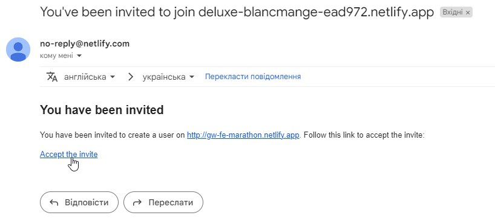

У вікні, що відкриється, користувач побачить кнопку "Login with Netlify
Identity". форму з можливістю авторизуватися. Для цього потрібно обрати Sign Up
і ввести у формі email та пароль. // ??

Після цього адміністратор отримає лист на введену пошту із проханням підтвердити
реєстрацію. Для цього потрібно перейти за посиланням у листі.

## Структура адмін-панелі

Адмін-панель має наступну структуру:

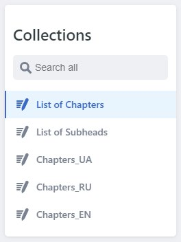

- List of Chapters - це перелік розділів (у нашому випадку - днів).

  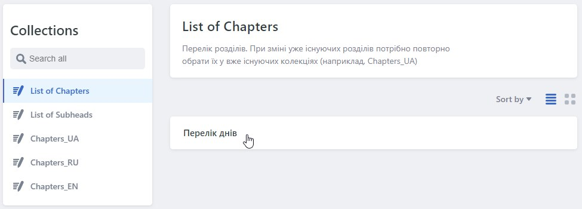

  Він представлений як один елемент колекції, який не можна видалити. Також не
  можна створити новий елемент. Передбачена лише можливість редагування розділів
  всередині даної колекції.

  При переході на перелік днів адміністратор побачить його структуру, яка
  складається із списку. Елементами списку є назви папок для збереження розділів
  (CHAPTER NAME: start, day-1 та ін.)

  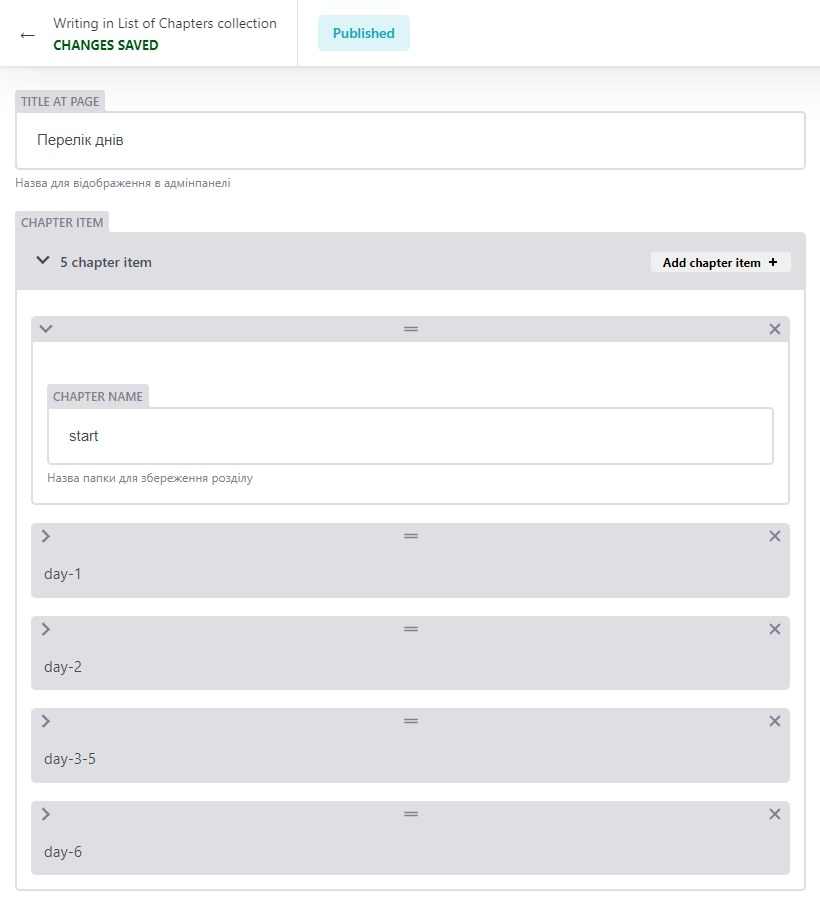

  ⚠️ Цей перелік потрібно редагувати лише у конкретних випадках. (див. нижче
  "Правила додавання нових записів").

  ***

- List of Subheads - це перелік підрозділів (у нашому випадку - Загальні питання
  та VSCode).

  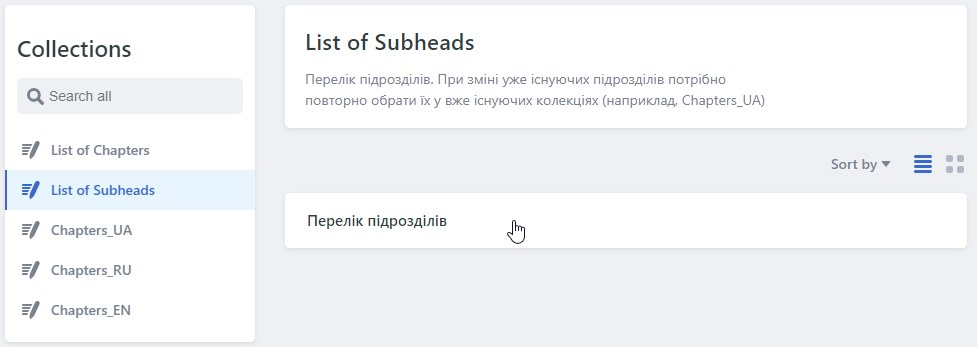

  Він також представлений як один елемент колекції, який не можна видалити, так
  само як і не можна створити новий елемент. Передбачена лише можливість
  редагування підрозділів всередині даної колекції.

  При переході на перелік підрозділів адміністратор побачить його структуру, яка
  складається із списку. Елементами списку є два підрозділи - Загальні питання
  та VSCode.

  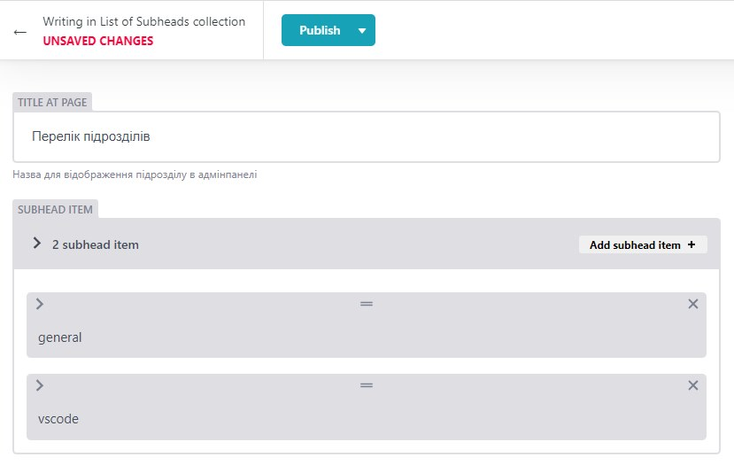

  ⚠️ Цей перелік потрібно редагувати лише у конкретних випадках. (див. нижче
  "Правила додавання нових записів").

  ***

  Далі слідують колекції, упорядковані за мовою інтерфейсу:

- Chapters_UA
- Chapters_RU
- Chapters_EN

  У кожній із них контент вводиться відповідною мовою.

  Елементами цих колекцій є розділи із переліку List of Chapters (у нашому
  випадку - дні).

  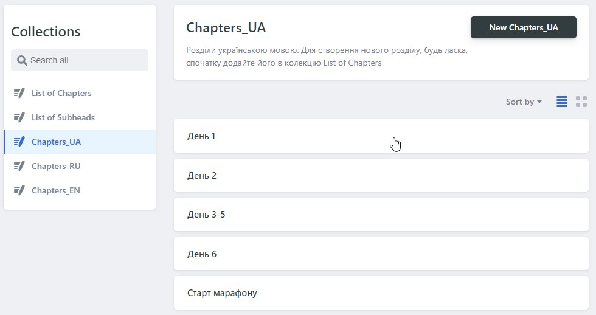

  ***

## Правила додавання нових записів

В основному адміністратор працюватиме з колекціями Chapters_UA, Chapters_RU та
Chapters_EN, додаючи нові запитання.

Однак проєктом також передбачена можливість динамічного додавання нових розділів
(днів) та підрозділів, які після створення через адмін-панель автоматично будуть
додаватися на сайті.

### Додавання розділів (у нашому випадку - днів)

Для створення нового розділу потрібно в адмін-панелі зайти у колекцію List of
Chapters -> Перелік розділів. Далі потрібно натиснути на кнопку "Add chapter
item" та ввести дані для нового розділу.

Значення, введене у поле CHAPTER NAME, обов'язково повинно містити лише малі
латинські літери, цифри та тире, наприклад, "day-7".

Після додавання нового елемента списку потрібно натиснути кнопку Publish ->
Publish now. Нові дані автоматично відправляються у репозиторій проєкту, а після
успішного збереження адміністратор побачить повідомлення "Entry saved". Після
цього потрібно повернутися до загального вигляду адмін-панелі.

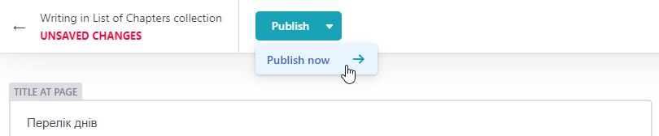

Після того, як розділ додано, адміністратор може перейти в колекції Chapters_UA,
Chapters_RU та Chapters_EN та почергово додати запитання для нового розділу
відповідними мовами. Для цього потрібно натиснути на темну кнопку New Chapters
вгорі.

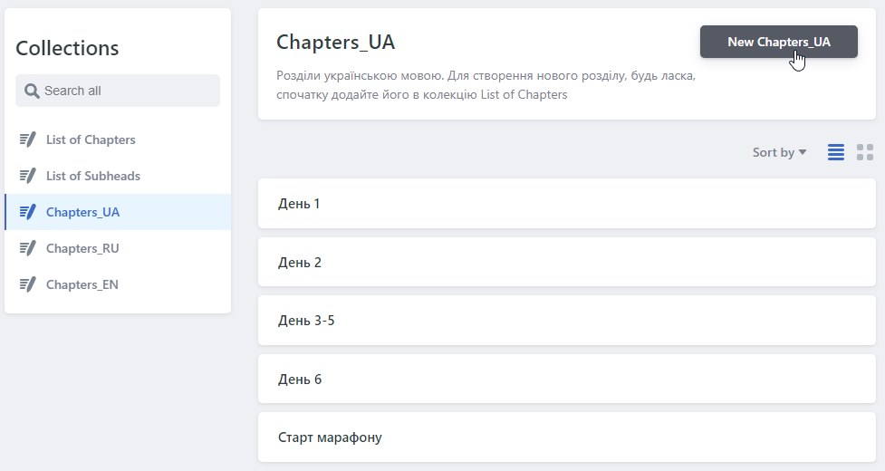

Далі потрібно заповнити поля, слідуючи вказівками біля кожного поля. У полі
CHAPTER із випадаючого списку необхідно вибрати новостворений розділ, наприклад,
"day-7".

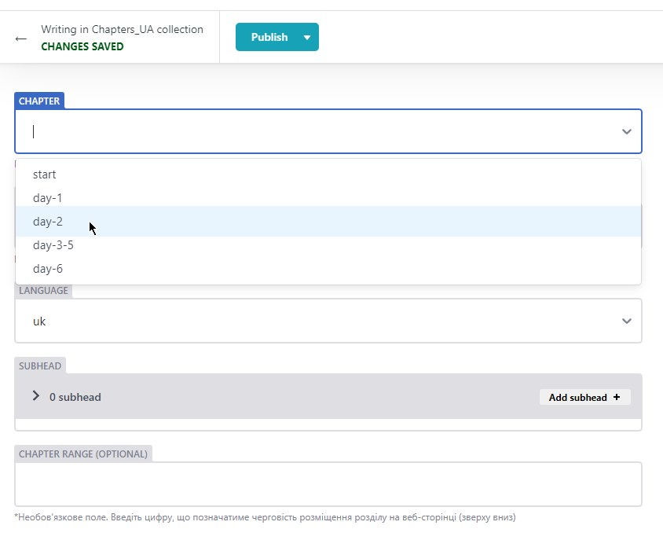

У полі TITLE AT PAGE потрібно ввести назву для відображення даного розділу на
сайті (наприклад, "День 1" для колекції Chapters_UA, "Day 1" для колекції
Chapters_EN тощо).

Далі потрібно натиснути на кнопку "Add subhead" та обрати у полі SUBHEAD TITLE
із випадаючого меню потрібний підрозділ (Основні питання чи VSCode).

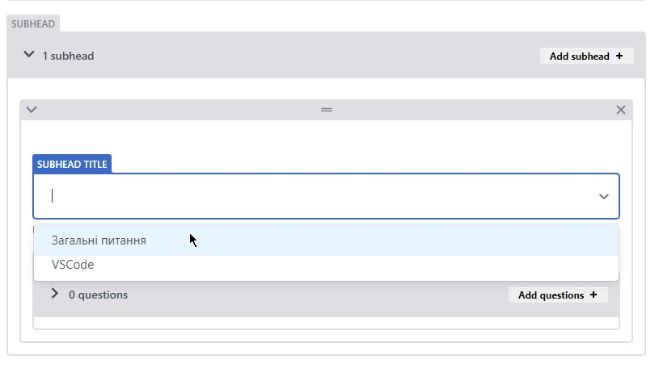

Після цього можна додавати запитання, натискаючи на кнопку "Add questions" та
заповнюючи необхідні поля QUESTION TITLE і DESCRIPTION.

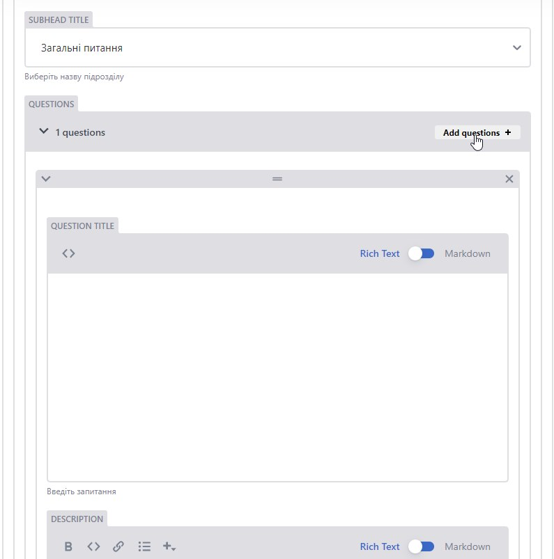

У полі DESCRIPTION за необхідності можна додати зображення, натиснувши на +,
code, посилання, а також виділити частину відповіді жирним шрифтом.

Поле QUESTION RANGE необов'язкове, але воно позначає черговість розміщення
питання на сторінці, а тому використовується для сортування запитань на сайті.

Поле CHAPTER RANGE останнє в кожному розділі, і воно позначає черговість
розміщення розділу на сайті та використовується для сортування днів марафону.

### Додавання підрозділів

У випадку створення нового підрозділу запитань (наприклад, "Дизайн") потрібно в
адмін-панелі зайти у колекцію List of Subheads -> Перелік підрозділів. Далі
потрібно натиснути на кнопку "Add subhead item" та ввести дані для нового
підрозділу.

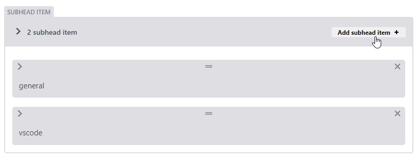

Потрібно заповнити усі поля. У полі SUBHEAD VALUE потрібно ввести значення, яке
обов'язково повинно містити лише малі латинські літери, цифри та тире,
наприклад, "design".

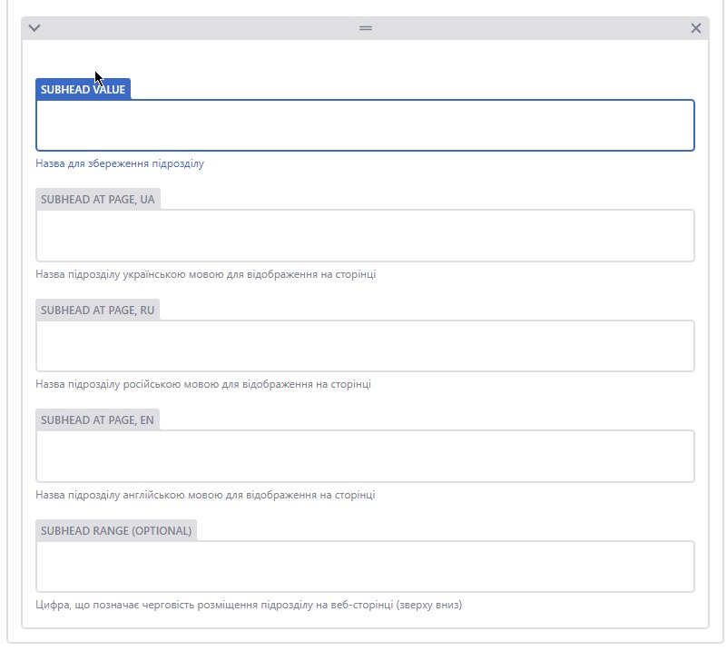

SUBHEAD AT PAGE - це поля для введення назви підрозділу кожною мовою. Це
значення використовується для відображення підрозділу на сайті.

Поле SUBHEAD RANGE позначає черговість розміщення підрозділу у розділі.

Після публікації змін даний підрозділ стане доступним для вибору у випадаючому
меню поля SUBHEAD TITLE у кожній колекції Chapters.

---

⚠️ Адміністратор має можливість змінити вже існуючі дані у переліках розділів та
підрозділів колекцій List of Chapters та List of Subheads.

Наприклад, при потребі змінити day-3-5 на day-3 є можливість редагування уже
існуючого розділу. Але для застосування змін потрібно обов'язково повторно
вибрати даний розділ чи підрозділ із випадаючого списку у всіх колекціях, в яких
він уже використовується.

---
